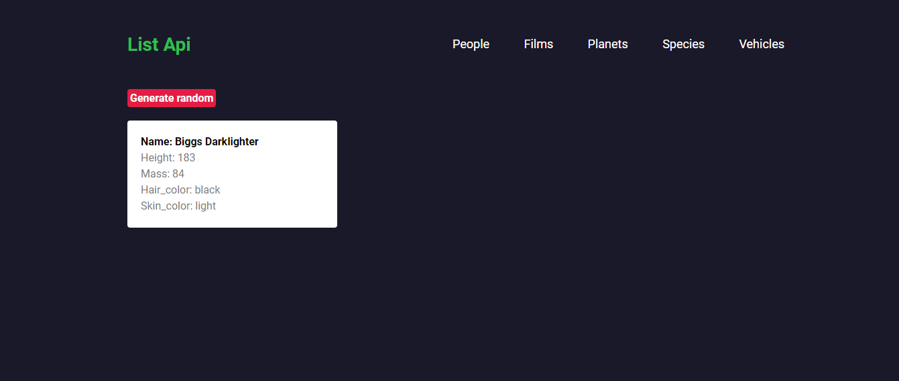
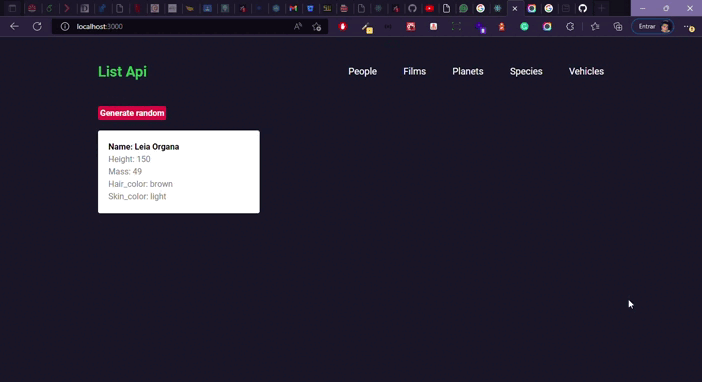

<h3 align="center">
    <br><br>
    <b> List Api é um sistema web, utilizado para consumir uma api externa, Atraves do botão de generate random:  ele gera cards aleatório pegando os dados da api referente a cada rota!</b>  
    <br>
</h3>


# Índice

- [Sobre](#sobre)
- [Tecnologias Utilizadas](#tecnologias-utilizadas)
- [Como Usar](#como-usar)
- [Como Contribuir](#como-contribuir)

## :bookmark: Sobre
O <strong>List Api</strong> é um projeto teste do Grupo Soma, utilizado para validar os conhecimentos dos candidatos.


<a id="tecnologias-utilizadas"></a>

## :rocket: Tecnologias Utilizadas

O projeto foi desenvolvido utilizando as seguintes tecnologias

- [React]("")
- [Styled-components]("")
- [TypeScript]("")

## :heavy_check_mark: :iphone: Versão Desktop

<h1 align="center">
    
</h1>

## :heavy_check_mark: :computer: Video da Aplicação

<h1 align="center">
    
</h1>


<a id="como-usar"></a>

## :fire: Como usar

1. Faça um clone :

```sh
  $ git clone https://github.com/Rafael-Rufino/todo-list
```

2. Executando a Aplicação:

```sh
  # Instale as dependências
  $ npm install 
  ou 
  $ Yarn

  # Inicie a aplicação web
  $ cd too-list

  $ yarn start
  ou
  $ npm run start

```

<a id="como-contribuir"></a>


# :recycle: Como contribuir

- Faça um Fork desse repositório,
- Crie uma branch com a sua feature: `git checkout -b my-feature`
- Commit suas mudanças: `git commit -m 'feat: My new feature'`
- Push a sua branch: `git push origin my-feature`


## :memo: License

Esse projeto está sob a licença MIT. Veja o arquivo [LICENSE](LICENSE.md) para mais detalhes.


<h4 align="center">
    Feito com 💜 by <a href="https://portfolio-rafael-rufino.vercel.app/" target="_blank">Rafael Rufino</a>
</h4>
